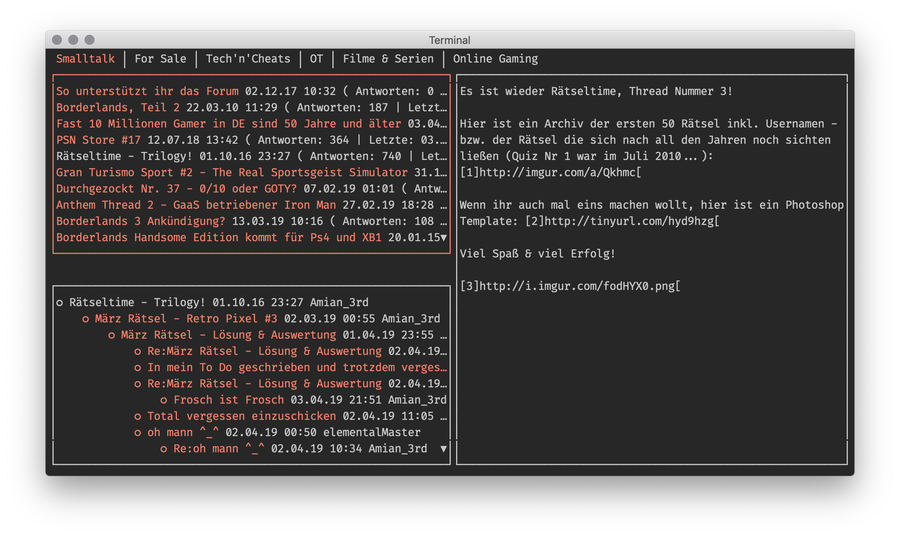

# Maniac Forum UI

## Download

Downloads für diverse Betriebssysteme finden sich in den [Releases](https://github.com/snipem/maniacforum/releases)

Oder alternativ `go get github.com/snipem/maniacforum`.

## Hilfe

### Kontext-Steuerung

    <Tab> - Fokus-Wechsel auf Boards, Threads, Unterthreads und Nachrichten
     ↑ ↓  - Zur Auswahl im aktuellen ausgewählten Menü
     ← →  - Auswahl des Boards
       a  - Auf Nachricht im Standard-Browser antworten
       ?  - Hilfsseite
       q  - Beenden
     0-9  - Links im Standard-Browser öffnen

### Globale Steuerung

       j  - Nächster Unterthread
       k  - Vorheriger Unterthread
       u  - Nächster ungelesener Unterthread
       z  - Nächster Thread
       J  - Nächster Thread
       K  - Vorheriger Thread

### Gelesen / Ungelesen Status von Beiträgen

`maniacforum` speichert den Lesestatus von Beiträgen standardmäßig unter `$HOME/.maniacread.log`. Der Pfad kann mit der Umgebungsvariable `$MANIACFORUM_READLOG_FILE` überschrieben werden. Zum Beispiel für den Sync über Dropbox: `MANIACFORUM_READLOG_FILE="$HOME/dropbox/maniacread.log" maniacforum`.

## Development

### Feature Requests

#### Open

* Native posting without browser - deli-
* Boss key - Stitch

#### Done

* ✓ Add read / unread status - mat

### Todo

* Actually scrape tabs
* Add scrolling message dialogue
* Add dynamic resizing

### Releasing

* Make git clean
* `make TAG_VERSION=0.0.12 release`
